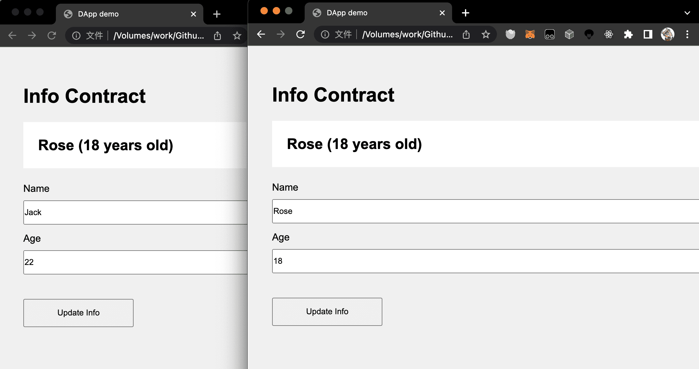

# dapp-demo

DApp 学习手记，用最简单的 demo 来直观了解 DApp。

本代码是根据下面的教程改写而来，之前的版本太老了，代码运行不起来，本项目予以更新。
同时也作为自己学习 DApp 的一个记录，如果能帮到你，当然更好。

文章

- [Web3与智能合约交互实战](https://learnblockchain.cn/2018/04/15/web3-html/)
- [搞懂 Solidity 事件Event - 如何在DApp中使用](https://learnblockchain.cn/2018/05/09/solidity-event/)

---

🕹 以下是发行代币和众筹示例

- [TokenERC20.md](TokenERC20.md)  为发行代币的合约的示例
- [crowdsale.md](crowdsale.md)  为使用智能合约进行众筹的示例

---

🕹 以下是 web3.js 交互示例

- [InfoContract.sol](InfoContract.sol) 合约部分
- [index.html](index.html) web3.js 和合约交互部分

## 需要安装

- remix
    - 不想安装的，就用在线版 https://remix.ethereum.org/
    - 愿意折腾的，可以按官方文档安装本地版本 https://github.com/ethereum/remix-project
    - 用于部署合约，获取合约地址和 ABI
- ganache
    - 下载地址 https://trufflesuite.com/ganache/
    - 用于搭建本地测试链，这样就不用连到公链了，并且提供了完善的 GUI 页面可供预览
- metamask
    - 谷歌插件，也被叫做 小狐狸
    - 提供全局的 Web3 对象
    
## 用到的一些库

- web3.js
    - 用于链接 ui 和 智能合约
    
## 效果展示

两个打开的页面，一个信息更新后，另一个接收到事件，同步更新

Ganache 效果

